# MarketFreak

## Nombre del proyecto
MarketFreak

## Descripción del proyecto
El proyecto consiste en el diseño y la programación de una página web orientada a ser un marketplace de objetos de coleccionismo.

## Miembros del proyecto
- Jerónimo Omar Falcón Dávila - [@jerofd-02](https://github.com/jerofd-02)
- Néstor Lucas Deníz González - [@Neestoor13](https://github.com/Neestoor13)

## Requisitos funcionales
Básicamente, el sistema debe permitir que cualquier usuario se registre en el sitio web para crear una cuenta personal y por tanto, un perfil. También debe permitir que los usuarios inicien sesión para acceder a su perfil y que puedan modificar su información personal con el fin de mantener sus datos actualizados.

Los usuarios deben poder publicar productos para ponerlos a la venta, así como editar los productos que hayan subido para modificar su información cuando sea necesario.

Los compradores deben poder visualizar el nombre, el precio, la descripción y la categoría de los productos antes de adquirirlos. Así mismo, deben poder comprar los productos que les interesen y disponer de al menos un método de pago que les permita realizar las transacciones.

El sistema también debe permitir que los usuarios añadan productos a una lista de deseos para guardarlos y comprarlos más adelante. Además, debe ofrecer una barra de búsqueda para encontrar productos fácilmente y la posibilidad de filtrarlos por categoría para mostrar únicamente aquellos que resulten de interés.

Por último, los usuarios deben poder contactar con el servicio de soporte mediante un formulario para resolver dudas o problemas, y acceder a una página de preguntas frecuentes y políticas donde se explique el funcionamiento del sitio web.

## Storyboards y mockups
Se puede ver en el repo un [PDF](mockups/Storyboards_Mokcups.pdf), que contiene el Storyboard y los Mockups. También están las imágenes de todos los mockups en el siguente [directorio](mockups)

## Lista de páginas
- [index.html](index.html): Página principal. El mockup es [01_Index.png](mockups/01_Index.png)
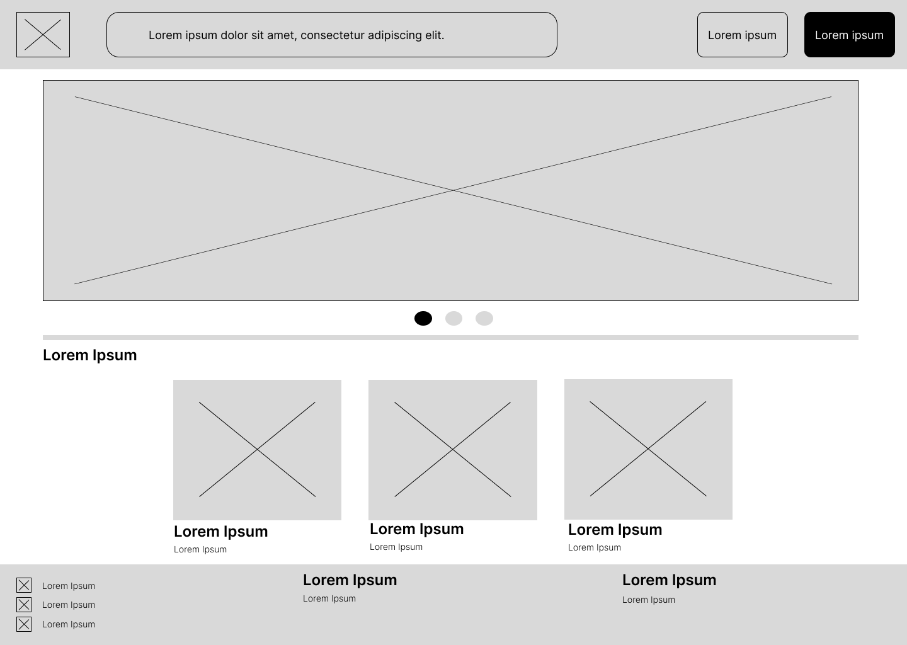
Esta página contiene el header que dirige a la búsqueda, inicio de sesión y registro.
Luego en el body, implementa un carrusel y una lista de productos.
El footer tiene tres columnas, una para las redes sociales, una para la página de contacto/soporte y el último para FAQ.
**El header y el footer se repiten en todas las páginas así que se da por hecho que está explicado.**

- [search_product.html](search_product.html): Página de búsqueda de producto. El mockup es [02_Búsqueda_de_productos.png](mockups/02_Búsqueda_de_productos.png)
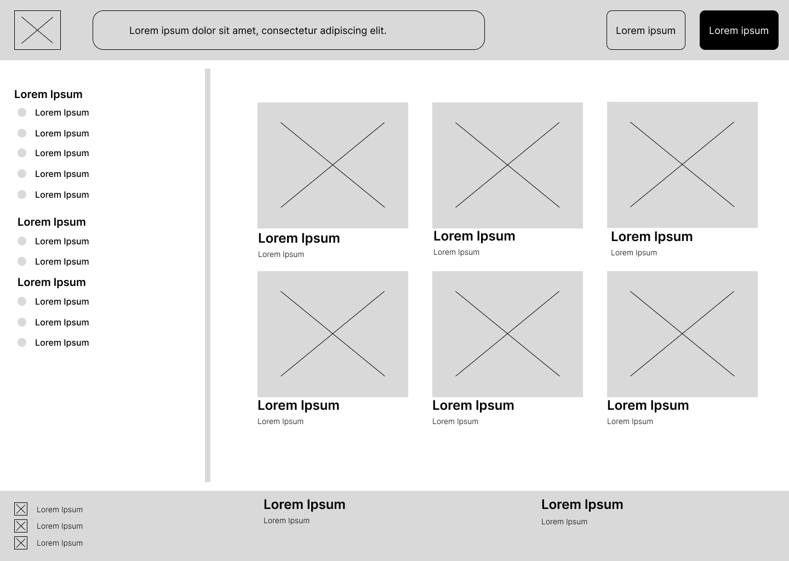
El body, tiene un sidebar e implementa los productos como la fila que vimos antes, solo que duplicada.

- [login.html](login.html): Página de inicio de sesión. El mockup es [03_Inicio_de_Sesión.png](mockups/03_Inicio_de_Sesión.png)
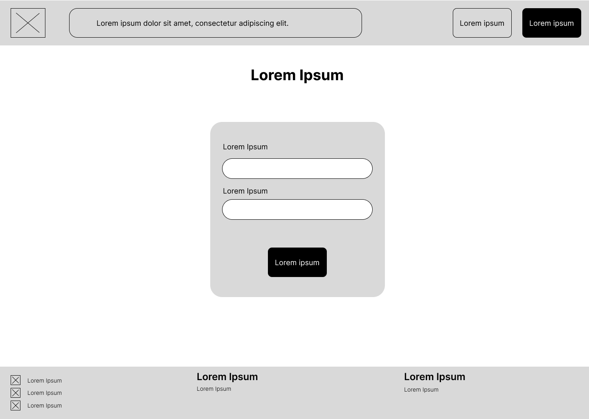
Esta página implementa un formulario para iniciar sesión mediante email y contraseña.

- [register.html](register.html): Página de registro. El mockup es [04_Registro.png](mockups/04_Registro.png)
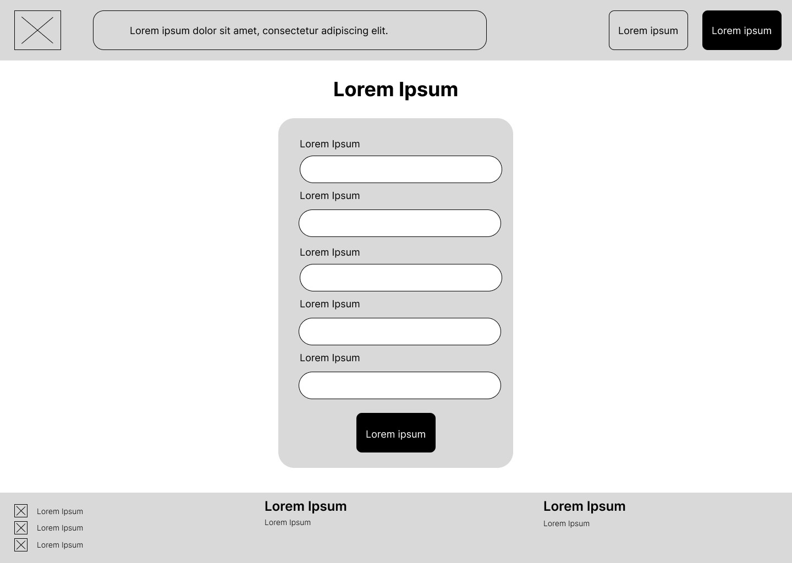
Esta página implementa un formulario para registrarse en la página con los campos:
- Nombre de usuario
- Email
- Contraseña
- Confirmar contraseña
- Fecha de nacimiento
- Entre otros...

- [contact_page.html](contact_page.html): Página de contacto / Soporte. El mockup es [05_Contacto-Soporte.png](mockups/05_Contacto-Soporte.png)
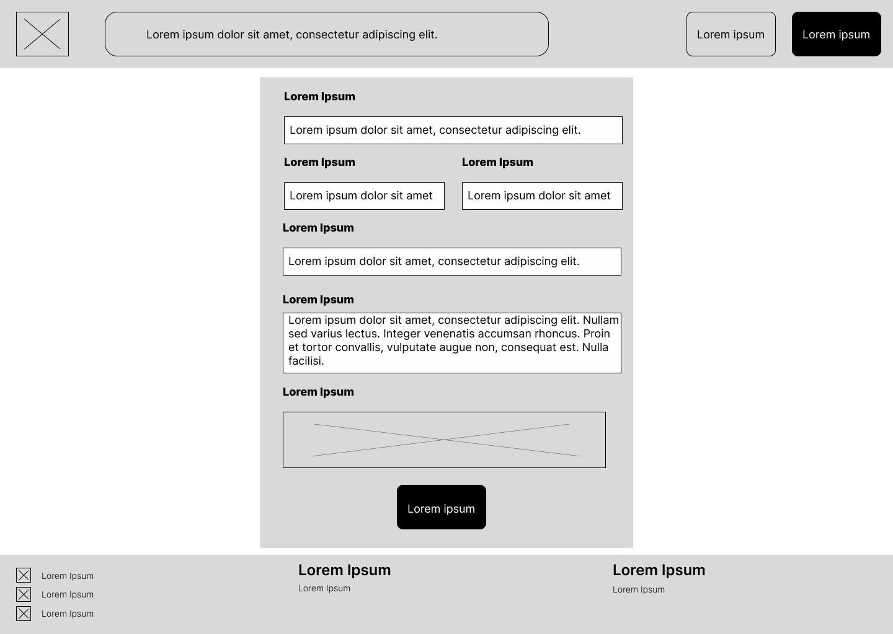
Esta página implementa un formulario para contactar con soporte con los campos:
- Email
- Nombre
- Apellidos
- Categoría del problema
- Descripción del problema
- Subida de ficheros
- Entre otros...

- [faq.html](faq.html): Página de preguntas frecuentes / Políticas. El mockup es [06_FAQ-Políticas.png](mockups/06_FAQ-Políticas.png)
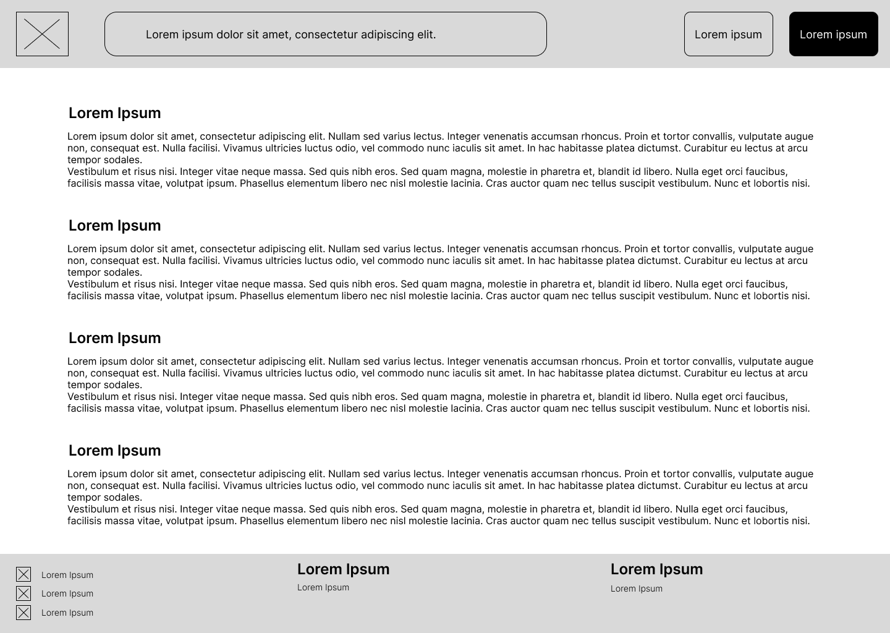
Esta página implementa unos textos que hablan sobre las preguntas frecuentes que puedan tener los usuarios.

- [product_page.html](product_page.html): Página de producto. El mockup es [07_Página_del_producto.png](mockups/07_Página_del_producto.png)
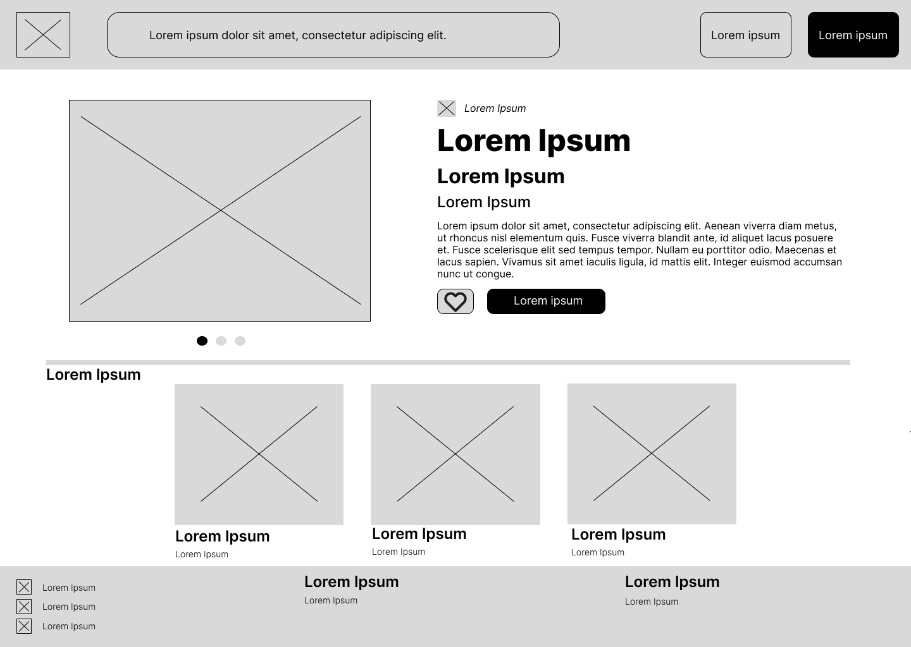
Esta página implementa el carrusel y una descripción, junto a los botones de lista de deseos y comprar, también como el index, está la fila de productos llevará a otros productos del usuario.

- [payment_page.html](payment_page.html): Página de pago del producto. El mockup es [08_Pago_del_producto.png](mockups/08_Pago_del_producto.png)
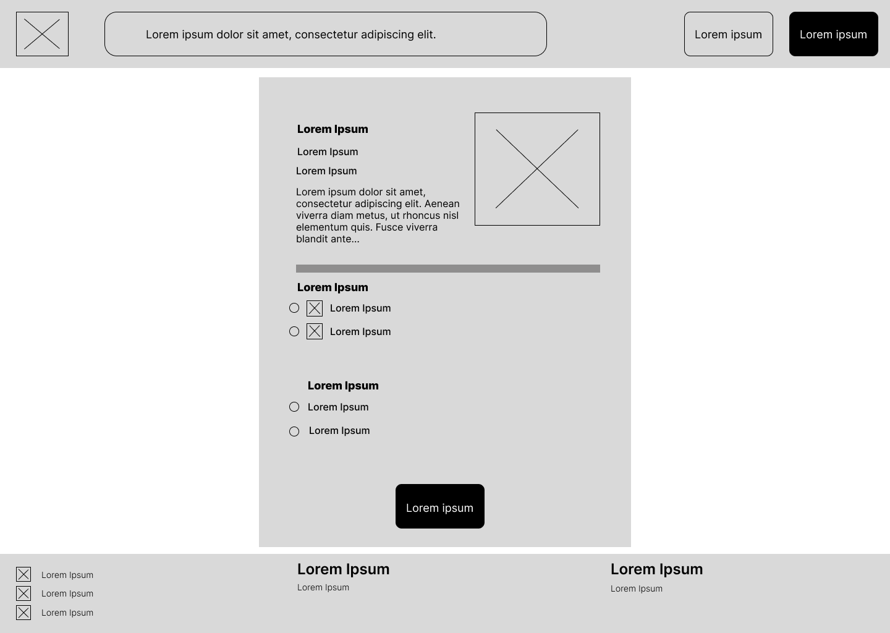
Esta página implementa un formulario, con la descripción del producto, forma de pago, tipo de envío, entre otros...

- [confirmation.html](confirmation.html): Página de confirmación del pago. El mockup es [09_Pantalla_de_confirmación.png](mockups/09_Pantalla_de_confirmación.png)
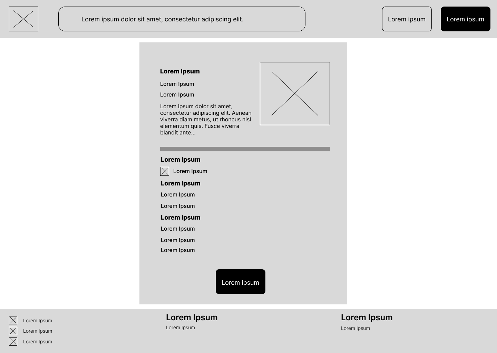
Esta página, es muy parecida a la anterior, implementa un formulario, con la descripción del producto, forma de pago seleccionada, tipo de envío seleccioinado, e información del vendedor, entre otros...

- [wishlist.html](wishlist.html): Lista de deseos personal del usuario. El mockup es [10_Lista_de_deseos.png](mockups/10_Lista_de_deseos.png)
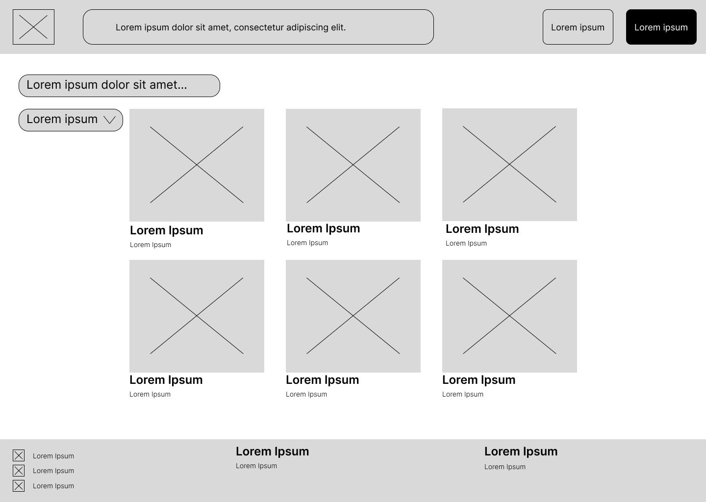
Esta página, implementa un filtro y dos filas de productos.

- [profile.html](profile.html): Página del perfil. El mockup es [11_Perfil_del_usuario.png](mockups/11_Perfil_del_usuario.png)
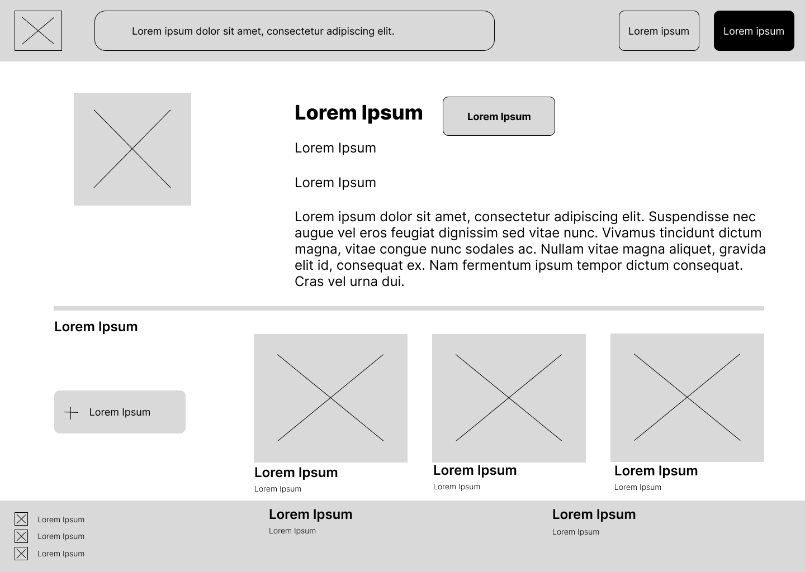
Esta página, implementa una foto, la descripción con un botón para modificar el perfil, en la parte de abajo, un botón para añadir producto, junto la fila de productos del perfil.

- [update_profile.html](update_profile.html): Página para modificar el perfil. El mockup es:[12_Editar_perfil_configuración_cuenta.png](mockups/12_Editar_perfil_configuración_cuenta.png)
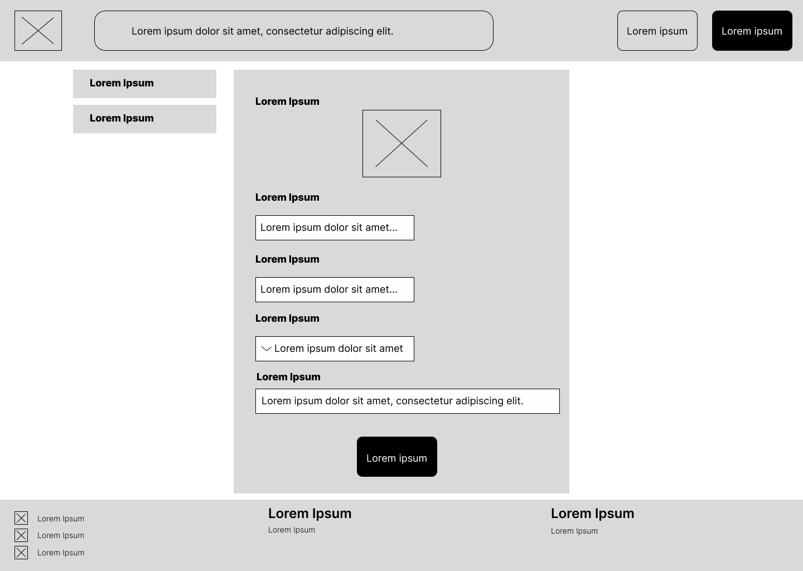Esta página implementa un formulario para modificar el template con los campos:
- Subida de la foto de perfil
- Usuario
- País
- Descripción
- Entre otros...

- [upload_product.html](upload_product.html): Página para subir / modificar producto. El mockup es [13_Edición_del_producto.png](mockups/13_Edición_del_producto.png)
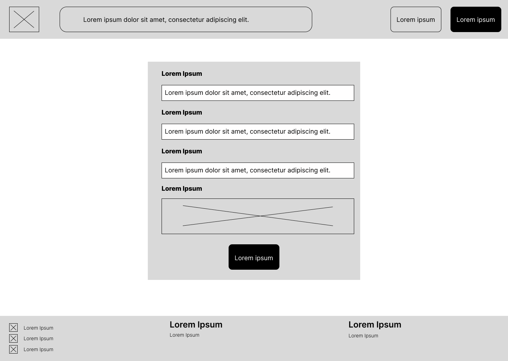
Esta página implementa un formulario para modificar el template con los campos:
- Nombre
- Precio
- Descripción
- Subida de fotos del producto
- Entre otros...

## Templates
- [carousel.html](templates/carousel.html): Plantilla de un carrusel de imagenes en index.html y product.html.
- [faq-template.html](templates/faq-template.html): Plantilla de la sección de preguntas frequentes en faq.html.
- [footer.html](templates/footer.html): Plantilla de el footer o pie de página en todas y cada una de las páginas.
- [form_style_page.html](templates/form_style_page.html): Plantilla de formulario en contact_page.html
- [header.html](templates/header.html): Plantilla de el header o encabezado de página en todas y cada una de las páginas.
- [login-template.html](templates/login-template.html): Plantilla de la sección de inicio de sesión en login.html.
- [payment_confirmation.html](templates/payment_confirmation.html): Plantilla de la sección pago en payment_page.html.
- [photo_row.html](templates/photo_row.html): Plantilla que es una fila de imagenes que llevan a un producto en el index.html, search_product.html, wishlist.html y profile.html.
- [product_information.html](templates/product_information.html): Plantilla que es una descripción del producto con nombre, categoría, en el product_page.html, profile.html.
- [product_information.html](templates/register-template.html): Plantilla de la sección de registro de usuario en register.html.

## Directorios
El repositorio tiene la siguiente estructura de directorios:
- **images/:** Imágenes que se usan en las páginas durante el proyecto.
- **mockups/:** Imágenes de los mockups hechos en Figma.
- **styles/:** Hoja de estilos en cascada o CSS usados en el proyecto.
- **templates/:** Planitllas o partes reutilizables a través de distintas páginas web.

La raíz del directorio **contiene las páginas completas** usando templates (en caso de haberlos).
