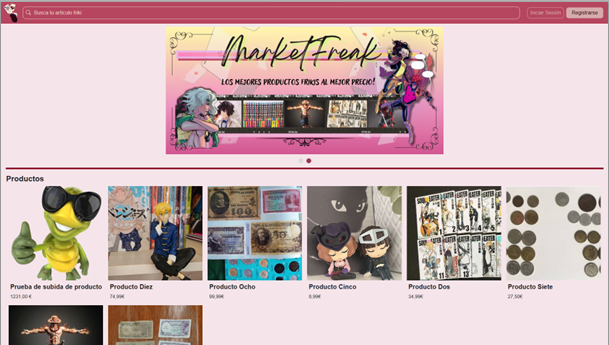
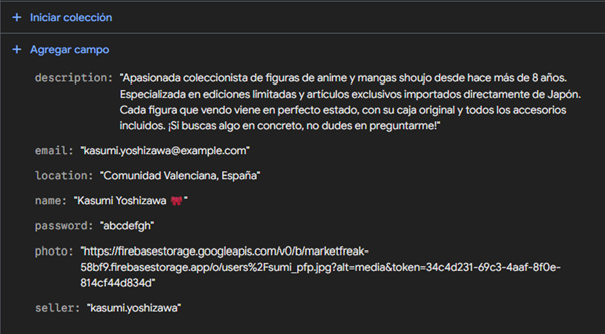

# MarketFreak
<div align="center">
    
</div>

## Índice
- [Índice](#índice)
- [Proyecto](#proyecto)
- [Despliegue](#despliegue)
- [Estructura del proyecto: componentes y funcionalidad](#estructura-del-proyecto-componentes-y-funcionalidad)
- [Estructura de datos en Firebase y Firestore](#estructura-de-datos-en-firebase-y-firestore)

## Proyecto
### Nombre
MarketFreak

### Descripción
El proyecto consiste en el diseño y la programación de una página web orientada a ser un marketplace de objetos de coleccionismo.

### Miembros
- Jerónimo Omar Falcón Dávila - [@jerofd-02](https://github.com/jerofd-02)
- Néstor Lucas Deníz González - [@Neestoor13](https://github.com/Neestoor13)

### Librerías usadas
Se ha usado [nodejs](https://github.com/nodejs/node) para instalar todas las dependecias del proyecto. Entre las destacadas están:
- El proyecto se ha generado con [Angular CLI](https://github.com/angular/angular-cli) en su versión 20.
- Se han usado las librerías de Firebase como [@angular/fire](https://github.com/angular/angularfire), y [firebase](https://github.com/firebase/firebase-js-sdk) así como su [consola](https://console.firebase.google.com/).
- También para el CSS se ha usado [Bootstrap](https://github.com/twbs/bootstrap) para las clases que usan los componentes HTML y [Bootstrap Icons](https://github.com/uiwjs/bootstrap-icons) para los iconos.

## Despliegue en local
Para lanzar el proyecto en local basta con lanzar el siguiente comando con la ruta donde esté guardado el proyecto:
```bash
ng serve
```
**Usuario de prueba:**
- **Email:** armin.keenan@example.com
- **Contraseña:** validacionformulario

Si no se desea acceder con ese usuario, siempre se puede registrar en la página, de forma independiente.

## Estructura del proyecto: componentes y funcionalidad
En el proyecto hacemos la distinción entre components y pages, esto se hace porque, los components los tratamos como si fueran las templates del sprint anterior y las pages como las páginas que usan esas templates antes mencionadas.

**Components:**
- **carousel**: Carrusel de imágenes usado en la página web. Se utiliza para información promocional, muestra de las imágenes de nuestros productos...
- **faq**: Página con preguntas relevantes sobre la página.
- **footer**: Es el pie de página de todas las páginas, incluyen las redes sociales, formulario de contacto y FAQ.
- **form-style-page**: Formulario de referencia, para la creación de otros formularios.
- header: Es la cabecera de todas las páginas barra de búsqueda e inicio de sesión.
- **login**: Formulario de inicio de sesión, permite al usuario iniciar sesión en nuestra página web.
- **photo-row**: Son las filas de productos que se ofertan en la página web y cada uno de los artículos te redirige al producto concreto.
- **product-info**: Contiene detalles del producto.
- **range-slider**: Es un deslizador, que se usa para el selector de precios en search-product.
- **register**: Formulario de registro de sesión, obviamente permite al usuario crear una cuenta en nuestra página web. 

<div align="center">
    
    <p style="align-content: center">Captura del componente footer.</p>
</div>

**Pages:**
- **confirmation**: Recibe la información de payment para finalizar el proceso de compra.
- **contact**: Es una página que implementa un formulario para contactar con soporte. Usa el componente form-style-page.
- **home**: Muestra de algunos productos de nuestra página web, mediante un photo-row y tiene un carusel con información promocional de la página. Esta es la primera página que se encuentra
- **payment**: Es un formulario para realizar el proceso de compra. Pregunta sobre el método de pago, el método de envío.
- **product-page**: Página del producto deseado. Ofrece información relativa al producto: precio, categoría e información adicional (descripción). Si el vendedor tiene más productos en venta, se mostrán. Si el usuario es propietario del producto, podrá **eliminar** o **editar** el produto. Usa el carrusel y el photo-row como componentes.
- **profile**: Información relativa al vendedor (usuario, ubicación, descripción, productos en venta) se muestra en la misma. Si el usuario autenticado es el propietario del perfil, podrá **editarlo** y **subir** productos. Usa product-info y photo-row como componentes.
- **search-product**: Si buscas un producto en la barra de arriba, te lleva a esta página. 
Según la búsqueda introducida, se mostrarán unos productos u otros según coincidan con el nombre de un producto o usuario. Asimismo, para los resultados obtenidos se permitirá realizar un filtrado (precio, rango de precios, categoría o fecha).
- **update-profile**: Actualización de la información del vendedor. Si el vendedor lo requiriera, podrá modificar su foto de perfil, su comunidad autónoma y/o su descripción.
- **upload-product**: Formulario de subida de producto. El usuario autenticado introducirá la información necesaria del producto que desea subir. Si falta información importante, se le notificará al mismo. Si se necesita **modificar** un producto, te redirige a esta página. Usa como componente form-style-page.
- **wishlist**: Lista de productos guardados como favoritos. Cada usuario tiene el suyo propio. Permite el filtrado y búsqueda. Usa photo-row como componente.

<div align="center">
    
    <p style="align-content: center">Captura de la página principal.</p>
</div>

## Estructura de datos en Firebase y Firestore
La base de datos está organizada en cinco colecciones principales:
- **users**: Almacena el perfil de cada usuario registrado, en la información registrada se incluye nombre **(name)**, email **(email)**, nombre de usuario **(seller)**, así como su foto de perfil **(photo)** almacenada en **Storage** e información genérica como su localización **(location)** y descripción **(description)**.
- **faqs**: Almacena las preguntas frecuentes de la página web. Cada documento contiene los campos **question** y **answer** con el texto de la pregunta y su respuesta respectivamente.
- **products**: Almacena los productos publicados en la plataforma. Cada documento recoge la información del producto como su nombre **(name)**, descripción **(description)**, precio **(price)**, categoría **(category)**, la referencia al vendedor mediante el campo **seller**, la fecha de publicación en **dateAdded**, y las URLs de las imágenes del producto almacenadas en Firebase Storage, tanto la imagen principal **(image)** como el conjunto completo (en caso de haber más) **(images)**.
- **wishlists**: Almacena los productos deseados de cada usuario. Cada documento se identifica por el **seller** y contiene un array de products, donde cada entrada almacena el identificador del producto **(id)** y la fecha en que fue añadido **(dateAdded)**.
- **support-request**: Almacena los tickets de soporte enviados por los usuarios, incluyendo los datos de contacto nombre **(name)**, apellidos **(surname)** y email **(email)**, la categoría del problema **(problem)**, una descripción detallada **(description)**, imágenes adjuntas **(images)** y un timestamp de creación **(createdAt)** generado automáticamente por Firebase.

Las imágenes de todas las colecciones se almacenan en Firebase Storage, guardándose únicamente sus URLs de acceso en los documentos de Firestore. La relación entre colecciones se establece mediante el campo seller, que actúa como identificador común entre users, products y wishlists, y mediante el campo id de cada entrada en wishlists.products, que referencia directamente al documento correspondiente en la colección products.

<div align="center">
    
    <p style="align-content: center">Captura de colección de users.</p>
</div>