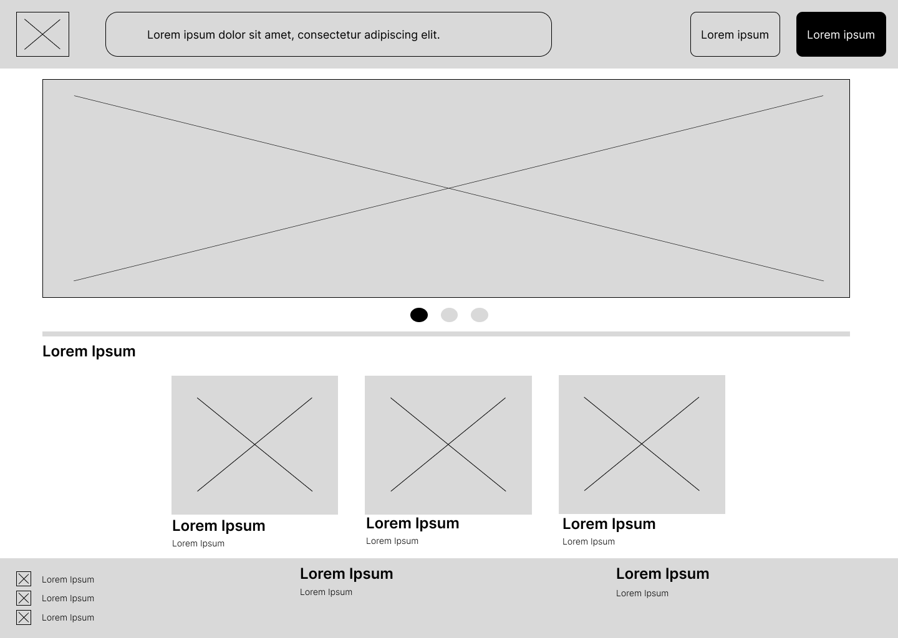
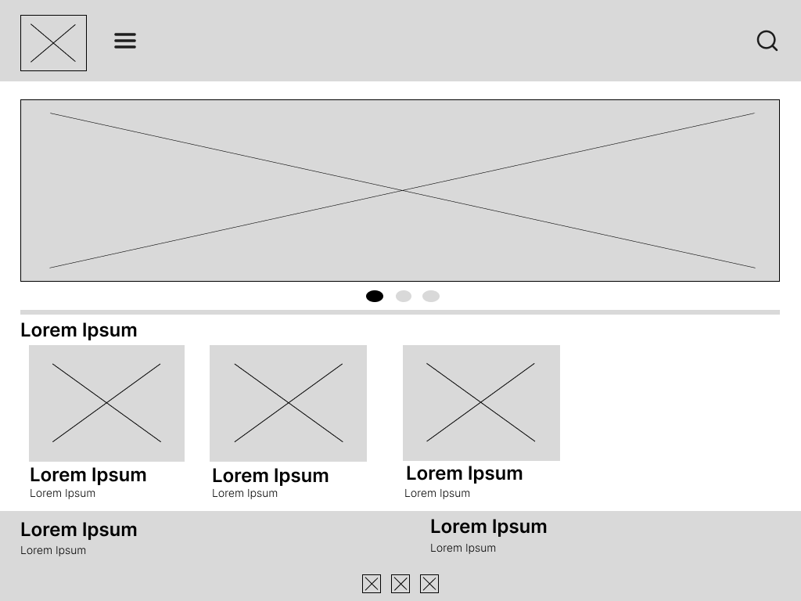
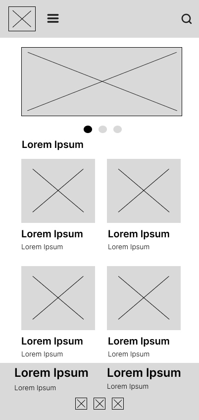

# MarketFreak
<div align="center">
    
</div>

## Nombre del proyecto
MarketFreak

## Descripción del proyecto
El proyecto consiste en el diseño y la programación de una página web orientada a ser un marketplace de objetos de coleccionismo.

## Miembros del proyecto
- Jerónimo Omar Falcón Dávila - [@jerofd-02](https://github.com/jerofd-02)
- Néstor Lucas Deníz González - [@Neestoor13](https://github.com/Neestoor13)

## Mockups
Los mockups se dividen en subcarpetas, según el dispositivo:
- Los de **escritorio** ubicados en [mockups/desktop](mockups/desktop), que representa la visualización en ordenadores y pantallas grandes.
- Los de **móvil** ubicados en [mockups/mobile](mockups/mobile), que representa la visualización en dispositivos móviles.
-  Los de **tablet** ubicados en [mockups/tablet](mockups/tablet), que representa la visualización en dispositivos móviles.

Cada una, tiene su PDF, para facilitar la visualización.

## Lista de páginas
- [index.html](index.html): Página principal.
- [search_product.html](search-product.html): Página de búsqueda de producto.
- [login.html](login.html): Página de inicio de sesión.
- [register.html](register.html): Página de registro.
- [contact_page.html](contact-page.html): Página de contacto / Soporte.
- [faq.html](faq.html): Página de preguntas frecuentes / Políticas.
- [product_page.html](product-page.html): Página de producto.
- [payment_page.html](payment-page.html): Página de pago del producto.
- [confirmation.html](confirmation.html): Página de confirmación del pago.
- [wishlist.html](wishlist.html): Lista de deseos personal del usuario.
- [profile.html](profile.html): Página del perfil. 
- [update_profile.html](update-profile.html): Página para modificar el perfil.
- [upload_product.html](upload-product.html): Página para subir / modificar producto.

### Responsive
Todas las páginas siguen el diseño responsive típico. Destacan:
- El **header** cuando detecta que la pantalla es muy pequeña, muestra un icono de hamburguesa, que contiene los elementos que estaban dentro del header cuando la pantalla era grande, y este a su vez, despliega el menú con todos los contenidos, y una lupa de búsqueda a la derecha, ya que también contrae la búsqueda que tiene el header.
- El **footer**, por otro lado, mueve los iconos de las redes sociales abajo al centro, sin texto, y conserva las dos columnas que están más a la derecha arriba.

Se indica el header y el footer porque son los contenidos comunes a todas las páginas. Luego, cada elemento que está en el contenido principal se adapta a la pantalla, según el tamaño.

Se muestra un ejemplo de la página web principal con los distintos diseños:
- Escritorio:<br>
- Tablet:<br>
- Móvil:<br><div align="center"></div>

### Carga de templates y contenido JSON
La carga de templates se ubican en el directorio [js](js), generalmente está controlado en el [common.js](js/common.js)

Este tiene dos funciones:
- ```loadCommonTemplates()```: Que carga el header y el footer (que son los los templates comunes a todas las páginas).
- ```loadTemplate()```: Que carga una o varias templates concretas del directorio templates para que la página lo cargue. No todas las páginas cargan templates a parte del header y el footer, pero las que lo requieren, lo cargan de esa forma.

El fichero common.js también encapsula las funciones que controlan el menú hamburguesa con ```initHamburgerMenu()``` o la lectura de los datos de JSON con ```fetchData()``` entre otros.

### Páginas con formularios y validaciones
Las páginas que utilizan formularios y validaciones son:
- [login.html](login.html): Utiliza **required** para comprobar que email y password no estén vacíos. También comprueba que la password **comprueba que sea mayor de 8 caracteres**.
- [register.html](register.html): Utiliza **required** para comprobar que el name, username, email y password y password_confirm no estén vacíos. También comprueba que la password y password_confirm **comprueba que sea mayor de 8 caracteres**.
- [contact_page.html](contact-page.html): Utiliza **required** para comprobar que ningún campo esté vacío. También en **file_charge** se comprueba que realmente se sube con **accept="image/*"** y también usa la opción **multiple** para subir varias imágenes a la vez.
- [payment_page.html](payment-page.html): Utiliza JavaScript para comprobar que ningún campo esté vacío.
- [confirmation.html](confirmation.html): Solo confirma el pago si todo salido bien, pero no realiza ninguna validación.
- [update_profile.html](update-profile.html): Utiliza **required** para comprobar que ningún campo esté vacío, excepto la descripción. También en **file_charge** se comprueba que realmente se sube con **accept="image/*"**.
- [upload_product.html](upload-product.html): Utiliza **required** para comprobar que ningún campo esté vacío. También en **file_charge** se comprueba que realmente se sube con **accept="image/*"** y también usa la opción **multiple** para subir varias imágenes a la vez.

Usuario de prueba:
- Email: armin.keenan@example.com
- Contraseña: validacionformulario

Se ha comentado el evento que hacia submit en el **register.html** y en el **upload-product.html** ya que se usaba localStorage como probar la funcionalidad de el registro y la subida del producto, respectivamente, en futuros sprints se planteará la solución correcta.

Tanto como en **wishlist.html** como en **search-product.html** tienen la funcionalidad de filtrado y se hace correctamente.

## Contenido JSON
Todo el contenido del JSON se encuentra en el directorio [data](data) y se maneja de forma local. Estos ficheros tienen desde el texto de las páginas hasta los datos de los usuarios y funcionan como una pequeña base de datos al no tener backend aún y se cargan con JavaScript.